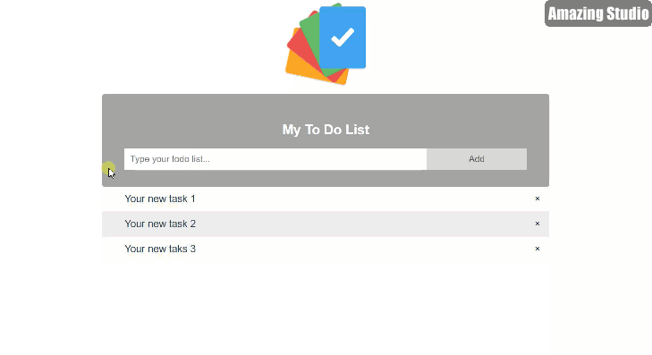

# TODOs APP





#### Instalacija python paketa (pozicionirati se u *root* direktorij projekta)

```
cd backend
pip install -r requirements.txt
```

#### Pokretanje TODOs CRUD aplikacije (pozicionirati se u *root* direktorij projekta)

```
cd backend/todos
python main.py
```

#### Pokretanje TODOs AI aplikacije (pozicionirati se u *root* direktorij projekta)

```
cd backend/todos_ai
python main.py
```


#### Pokretanje TODOs Vue.js aplikacije (pozicionirati se u *root* direktorij projekta)

```
cd frontend/vue-todos-app
npm install
npm run serve
```
